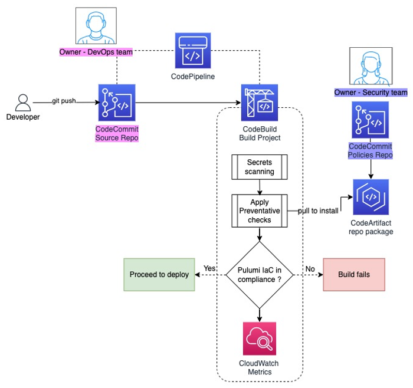
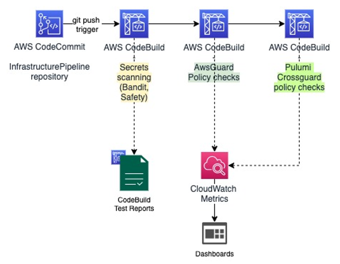
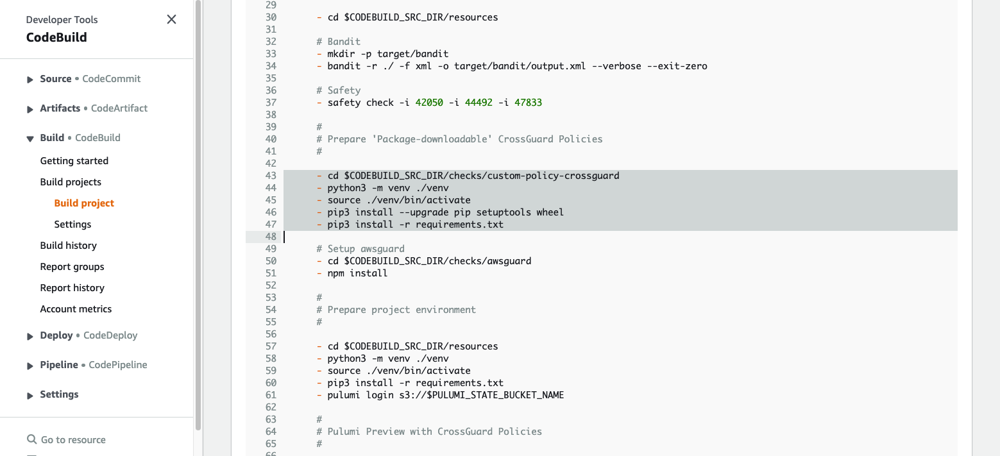
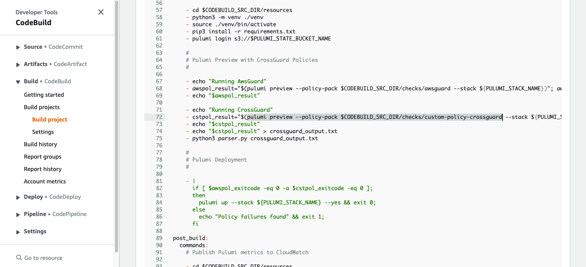
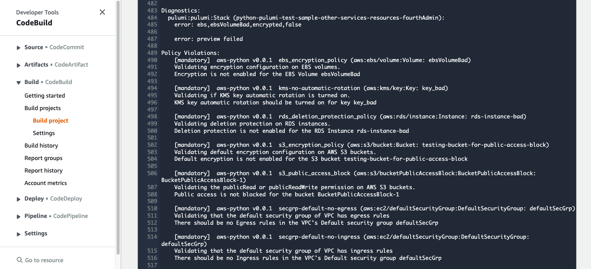
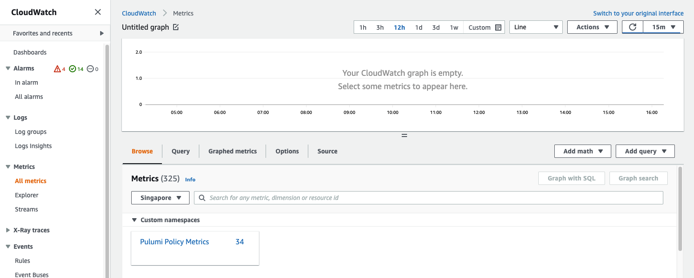
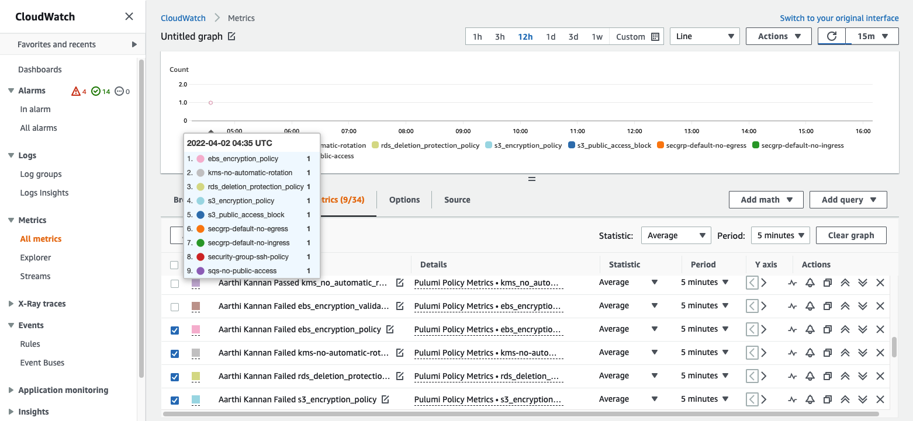

# Implementing Preventive Security Controls in Pulumi Infrastructure-as-Code Pipeline

###  Overview
This document explains the steps to implement, package and run Preventative Checks that use Policy-as-code to detect policy violations before Infrastructure-as-Code (IaC) components get deployed in the cloud. The IaC framework used is *[Pulumi](https://www.pulumi.com/)* and the Policy-as-code framework of interest is *[Pulumi Crossguard](https://www.pulumi.com/docs/guides/crossguard/)*, which has seamless integration with Pulumi. 

The sample code provides policies written in Pulumi CrossGuard, sample IaC resources defined with Pulumi framework to test the policies and a sample AWS CodeBuild build-specifications file to demonstrate enforcement of the preventive policies as part of an CI/CD pipeline. The sample is modeled for an AWS CodePipeline pipeline that deploys IaC changes when commits are made. This Pipeline checks for policy violations and takes appropriate actions prior to deployment.

### Introduction
As part of this artefact, policy-as-code has been implemented to detect policy violations in the Infrastructure-As-Code (IaC) components in the CI/CD pipeline. When violations are detected for a certain code component, the IaC is blocked from deployment. Metrics are collected for the failed scenarios and sent to Amazon CloudWatch Metrics for further analysis and monitoring.

### Deployment structure
While this sample  does not contain a full implementation of a CI/CD pipeline, the recommendation is to use AWS CodePipeline to orchestrate Continuous Deployment, AWS CodeCommit to store individual repositories for both policy-as-check code and the IaC resources, and an AWS CodeBuild project for which a sample buildspec.yaml file has been provided in this sample. The figure below shows an overview of the suggested pipeline for deploying resources.



This is the typical sequence of actions followed:
- The Security team defines the cloud security policies & controls and implements them as policy-as-code. This is maintained on a separate repo on the chosen version control service. AWS CodeCommit is used to store the policy-as-code in the sample provided. Everytime the Security team pushes changes, a new version of the package needs to be uploaded to AWS CodeArtifact.

- The DevOps team enforces the preventive checks as part of the buildspec file in the pipeline's CodeBuild project. The pre-build phase also covers other forms of security scanning. 

- The developers commit IaC code for deploying Cloud services and other resources in AWS, which triggers the build and the code is evaluated to measure compliance with built-in and custom policies.

- If the IaC is in compliance as a whole, the Deploy stage is invoked; even if one check fails, the build process is halted due to the failure.

- Corresponding metrics are published in CloudWatch or other destination as part of the post-build step.

### Pulumi Preventive Checks Options
There are a few options available to start developing policy-as-code with Pulumi:
1.	*[Pulumi Crossguard](https://www.pulumi.com/docs/guides/crossguard/)*
2.	*[AWSGuard](https://www.pulumi.com/docs/guides/crossguard/awsguard/)* codifies best practices for AWS 
3.	*[Pulumi OPA Bridge](https://github.com/pulumi/pulumi-policy-opa)* for CrossGuard – integration allows to deploy OPA policies via CrossGuard

For this artefact, we have considered options 1 and 2 only. Option 2 is written using Javascript and is available as a pre-built npm package. It has a limited set of policy checks which can either be enforced as Mandatory or Advisory; the former resulting in a policy violation emitting a Non-Informational violation. Pulumi’s multi-language approach allows to deploy AWSGuard to Pulumi Python code as well.
Since AWSGuard offers limited policies, we have developed additional customized policies using Pulumi CrossGuard in Python. Pulumi CrossGuard was chosen over OPA due to its native integration with Pulumi and support for writing policy checks in Python over Rego in OPA. Pulumi CrossGuard is generally available along with Pulumi 2.0. When Pulumi Enterprise is used, it allows for Organization-wide Policy Pack Management from the CLI. Pulumi’s multi-language approach allows you to author a Policy Pack using NodeJS or Python SDK and enforce the pack on a stack written in any language. Configurable Policy Packs allows for different configuration checks for different environments. 
In the absence of Pulumi Enterprise support, the custom policies can be packaged so that they can be easily deployed to all project repositories in the AWS organization, without having to copy-paste the code.

### Custom Policy Pack using Pulumi CrossGuard in Python
The preventive controls and policies have been written as code and stored in the folder named *custom-policy-crossguard-pkg* in the repository. The policy-as-code can be published as a Python package and hosted in the AWS CodeArtifact repository under a domain. From there, the package can be imported into each application project under the *checks/custom-policy-crossguard* sub-folder. Here In the sample repository, the sample infrastructure code to test the policies can be found under *sample-code/sample-resources/resources/*. The process to package the checks and import them via CodeArtifact has been documented in the following section.

#### Packaging & Distributing Pulumi CrossGuard Custom Policy packs using AWS CodeArtifact
The folder named *customer-policy-crossguard-pkg* contains the code and the documents required for packaging a Python project into a package that can be easily distributed, without having to copy the source code. This folder needs to be uploaded into a CodeCommit repository, and future changes and distributions managed from there. Refer to this [link](https://docs.aws.amazon.com/codecommit/latest/userguide/how-to-create-repository.html) for more information on how to create a CodeCommit repository. This repository is maintained typically by the Security Engineering team. 

Example how to create CodeCommit repository with AWS CLI:
```bash
    aws codecommit create-repository --repository-name custom-policy-crossguard-pkg --repository-description "Pulumi CrossGuard Policies repository"
```

Refer to the detailed instructions how to create [a CodeArtifact domain](https://docs.aws.amazon.com/codeartifact/latest/ug/domain-create.html) and [a CodeArtifact repository](https://docs.aws.amazon.com/codeartifact/latest/ug/create-repo.html) in the domain. Example how to create CodeArtifact domain and repository using AWS CLI:
```bash
    aws codeartifact create-domain --domain <domain-name>
    aws codeartifact create-repository --domain <domain-name> --domain-owner <aws-account-id> --repository <repository-name> --description "Pulumi CrossGuard policies packages"
```

The file *setup.cfg* contains the details of the package including the name and version number. Within the *src/* folder is the project folder that will be distributed as a package to be installed via pip.

To generate the distribution packages, the following commands are to be run from the same folder where *pyproject.toml* is located.

```bash
    python3 -m pip install --upgrade build
    python3 -m build 
```

This will generate two files in the *dist/* folder, as follows:

```bash
dist/
    <package_name>-<version_number>-py3-none-any.whl
    <package_name>-<version_number>.tar.gz
```

To upload the generated distribution archives, we use the twine package. The instructions are as follows:

```bash
    python3 -m pip install --upgrade twine
    aws codeartifact login --tool twine --repository <repository-name> --domain <domain-name> --domain-owner <aws-account-id>
    export TWINE_USERNAME=aws
    export TWINE_PASSWORD=`aws codeartifact get-authorization-token --domain <domain-name> --domain-owner <aws-account-id> --query authorizationToken --output text`
    export TWINE_REPOSITORY_URL=`aws codeartifact get-repository-endpoint --domain <domain-name> --domain-owner <aws-account-id> --repository <repository-name> --format pypi --query repositoryEndpoint --output text`
    python3 -m twine upload --repository <repository-name> dist/*  
```
    
This will upload the package to AWS CodeArtifact. This method allows for managing versions of the policy-as-code easily.  
To download the package and use it within the pipeline for policy enforcement, some additional commands are to be added into the *buildspec.yml* file for the pipeline. Specifically, these following command connects to the CodeArtifact repository and enable pip to download our custom package later. A sample buildspec file has been provided here *sample-code/sample-build-file/buildspec.yaml*.

```bash
    aws codeartifact login --tool pip --repository <repository-name> --domain <domain-name> --domain-owner <aws-account-id>
```

The preventative checks in the custom policy package cover the following items mapped to checks from *[Prowler](https://github.com/prowler-cloud/prowler)*. Prowler is an open-source security tool to perform AWS security best practices assessments, audits, incident response, continuous monitoring, hardening and forensics readiness. It contains more than 200 controls covering CIS, PCI-DSS, ISO27001, GDPR, HIPAA, FFIEC, SOC2, AWS FTR, ENS and custom security frameworks.

No.	| Prowler Category | Preventative Check
---|---|---|
1 |	[check28] |	Ensure rotation for customer created KMS CMKs is enabled
2 |	[check41] |	Ensure no security groups allow ingress from 0.0.0.0/0 or ::/0 to port 22
3 |	[check43] |	Ensure the default security group of every VPC restricts all traffic
4 |	[check29] |	Ensure VPC Flow Logging is Enabled in VPC 
5 |	[extra729] |	Ensure there are no EBS Volumes unencrypted
6 |	[extra7113] |	Check if RDS instances have deletion protection enabled 
7 |	[extra73] |	Ensure there are no S3 buckets open to Everyone or Any AWS user
8 |	[extra794] |	Ensure EKS Control Plane Audit Logging is enabled for 3 log types (api, audit, authenticator)
9 |	[extra797] |	Ensure Kubernetes Secrets are encrypted using Customer Master Keys (CMKs)
10 |	   |	Kubernetes Services should have default tags
11 |	[extra764] |	Check if S3 buckets have secure transport policy 
12 |	[extra734] |	Check if S3 buckets have default encryption (SSE) enabled or use a bucket policy to enforce it
13 |	[extra727] |	Check if SQS queues have policy set as Public

### Sample Infrastructure-as-Code using Pulumi Python
All IaC components are written with Pulumi v3.21.0, in Python 3.9. The sample code covers the following AWS infrastructure components:
- EC2 Security Groups
- EBS Volumes
- KMS CMKs
- RDS Instance
- S3 buckets
- SQS queues

The sample code for all the components highlighted in the list above are available under the folder *sample-code/sample-resources/resources* in the repository. Within *sample-code/sample-resources/checks/custom-policy-crossguard/requirements.txt* please add the name and version of the python package that has been built and deployed to AWS CodeArtifact. The *pulumi preview* command later refers to this checks folder for all policies to verify the deployable resources.
It is to be noted that the code included in the repositories contain example code for both successful and failure scenarios when enforcing the Pulumi CrossGuard policies. So, when deploying the resources defined in this sample as-is, it is expected to see build failure as shown in the figure below. Once the code for failure scenarios is removed, the build will succeed and resources will be deployed via *pulumi up*.

### Enforcing the checks in AWS CodeBuild
Create a CodeCommit repository with the sample IaC code from the folder *sample-code/sample-resources/*. Create an [AWS CodePipeline pipeline](https://docs.aws.amazon.com/codepipeline/latest/userguide/welcome.html), with the previously created repository set as the Source. Within the pipeline, create an [AWS CodeBuild project](https://docs.aws.amazon.com/codebuild/latest/userguide/how-to-create-pipeline.html) with the sample *buildspec.yml* file from *sample-code/sample-build-file*. 
The buildspec file follows steps to enforce these actions: 
- Installs all IaC packages and Static Analysis tools
- Runs static analysis on the source code
- Installs all project requirements for policy checks project and the resources project with *pip*
- Run policy checks via *pulumi preview* command with the downloaded policy-as-code package
- Deploy the resources if all policy checks have passed
- Upload metrics to AWS CloudWatch

The figure below visually depicts the steps within the buildspec.yml file.


In the *[buildspec.yml](sample-code/sample-build-file/buildspec.yaml)* file, the policy-as-check package is imported within *sample-code/sample-resources/checks/custom-policy-crossguard*. The corresponding commands are highlighted in the figure below. 



The checks are then enforced, following which deployment begins if all checks have passed. If any of the checks failed, the build fails with an error. The command to enforce the checks in the preview is highlighted in the figure below.



The build logs with the result of policy checks enforcement is shown below. As can be seen, some of the sample resources failed the policy checks, so the build has failed.

 

**Note** - The sample code provided as part of this artefact is for demo purposes only and should not be used in production or non-production environments directly. The policy-as-code provided should also be thoroughly tested in the production environments before using in production.

### Metrics for Policy-as-Code Checks
The CLI output from the 'pulumi preview' command is parsed using a [parser file](sample-code/sample-resources/resources/parser.py). The parser will generate all policy violations as cloudwatch metrics data in json. The Metric name corresponds to the policy check applied. The following dimensions are captured for each metric:
- Status – Failure status *(Only failures are captured at the moment)*
- Author – the name of the Committer
- Email – the email of the Committer

The metrics.json file generated by the parser is provided as input to the 'cloudwatch put-metric-data' copmmand to export all the captured metrics to CloudWatch Metrics and visualize there. CloudWatch Alarms can also be provisioned to monitor the status, if needed, as an additional step.
 


The above figure shows the namespaces generated during various test runs of the IaC build process. 
 


The above figure shows the detailed metrics data captured within the Pulumi Policy Metrics namespace. 

## Security

See [CONTRIBUTING](CONTRIBUTING.md#security-issue-notifications) for more information.

## License

This library is licensed under the MIT-0 License. See the LICENSE file.

